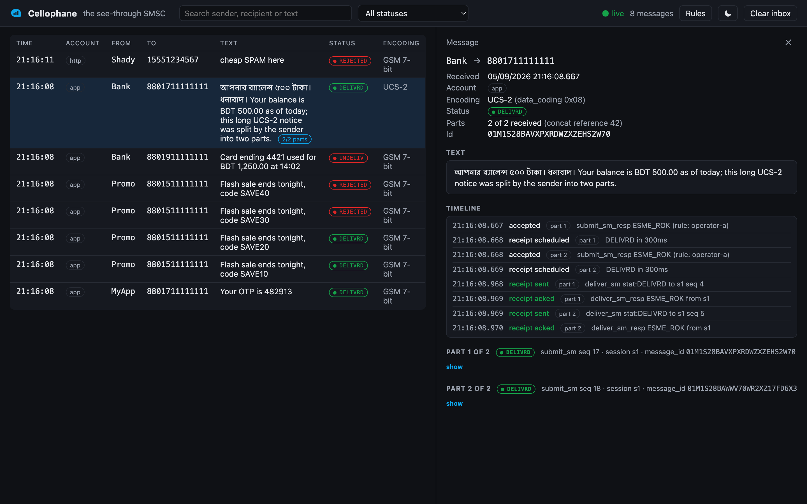

<p align="center">
  
</p>

<h1 align="center">Cellophane</h1>

<p align="center"><strong>Mailpit for SMS.</strong> The see-through SMSC — a fake mobile operator with a real inbox.</p>

<p align="center">
  <a href="https://github.com/YOU/cellophane/releases"></a>
  <a href="https://github.com/YOU/cellophane/pkgs/container/cellophane"></a>
  <a href="LICENSE"></a>
  <a href="https://github.com/YOU/cellophane/actions"></a>
</p>

---

Point your app's SMPP (or HTTP) client at **Cellophane** instead of a real operator. Every message lands in a live web inbox where you can search it, read the decoded text, inspect the raw PDU, and watch its delivery receipts arrive. Then tell the fake operator to misbehave — throttle, reject, delay, drop the connection — and see how your code copes.

No SIM cards, no per-message cost, no "please don't run the load test against the vendor sandbox again".

<p align="center">
  
</p>

## Quick start

```bash
docker run -p 2775:2775 -p 8025:8025 ghcr.io/YOU/cellophane
```

Open **http://localhost:8025**. Bind your SMPP client to `localhost:2775` with system_id `cellophane` and password `cellophane`, or just:

```bash
curl -X POST localhost:8025/api/v1/send \
  -H 'content-type: application/json' \
  -d '{"from":"MyApp","to":"8801711111111","text":"Your OTP is 482913"}'
```

The message is in your inbox before the command returns.

## What it does

**Speaks SMPP 3.4 like an operator.** Transmitter, receiver and transceiver binds; `submit_sm` with UDH/SAR concatenation; GSM 7-bit, Latin-1 and UCS-2; delivery receipts as standard `deliver_sm` DLRs; `enquire_link`; multiple ESME accounts, each with its own window size.

**Catches everything in a live inbox.** Messages stream in over SSE. Search by sender, recipient or text. Multi-part messages are reassembled and shown as one message with a parts badge. Click a message for the decoded text, the encoding, every TLV, an annotated hex dump of the PDU, and the timeline of its DLRs.

**Misbehaves on command.** Rules match on destination prefix, sender, account or text, and decide what the "operator" does:

```yaml
rules:
  - match: { to: "^88017" }          # one operator delivers fine
    accept: { dlr: DELIVRD, after: 2s }

  - match: { to: "^88019" }          # another one is flaky today
    accept:
      dlr: [ { DELIVRD: 80%, after: 3s }, { UNDELIV: 20%, after: 30s } ]

  - match: { to: "^88015" }          # this one is throttling you
    throttle: { tps: 5, then: ESME_RTHROTTLED }

  - match: { text: "(?i)spam" }
    reject: ESME_RINVDSTADR

  - match: { account: "chaos" }
    disconnect: { after: 10 }         # drops the bind after 10 messages

  - default:
      accept: { dlr: DELIVRD, after: 500ms }
```

Load rules from a file at start, or change them at runtime from the UI or the API — including mid-test from a CI step.

**Is scriptable end to end.** Everything the UI can do, the REST API can do: search and fetch messages, clear the inbox, assert that a message arrived, inject a mobile-originated message toward your receiver bind, swap the rule set, read stats. OpenAPI at `/api`.

```bash
# in your integration test
curl "localhost:8025/api/v1/messages?to=8801711111111&text=OTP&since=30s"
# → {"total":1,"messages":[{"id":"…","from":"MyApp","to":"8801711111111","text":"Your OTP is 482913","parts":1,"dlr":"DELIVRD"}]}

# make operator B fall over for the next test
curl -X PUT localhost:8025/api/v1/rules -d @chaos.yaml
```

## Why not SMPPSim?

SMPPSim is the tool most of us grew up with, and it still works. But its last release was more than a decade ago, its console is a 1990s HTML page, every behaviour lives in a properties file that needs a restart, and every Docker image of it is an unofficial wrapper several years old. Newer simulators each solve one piece — a dashboard here, YAML fault profiles there — and none has a searchable inbox, decoded PDUs, or a control API.

| | SMPPSim | rust-smpp-sim | go-smsc-simulator | **Cellophane** |
|---|---|---|---|---|
| Official Docker image | – | ✓ | compose only | ✓ |
| Web inbox with search | – | dashboard only | – | ✓ |
| Decoded text, concat reassembly, PDU view | – | – | – | ✓ |
| DLR lifecycle | ✓ | ✓ | ✓ | ✓ |
| Error-code / throttle / latency / disconnect rules | partial | – | ✓ | ✓ |
| Change behaviour at runtime | restart | – | – | ✓ UI + API |
| REST API for test assertions | – | – | read-only | ✓ |
| HTTP send endpoint | – | – | – | ✓ |
| Actively maintained | – | 2026 | 2026 | ✓ |

## Configuration

Everything has a sensible default. Override with environment variables or a mounted `cellophane.yaml`.

| Variable | Default | What it does |
|---|---|---|
| `CELLOPHANE_SMPP_PORT` | `2775` | SMPP listen port |
| `CELLOPHANE_HTTP_PORT` | `8025` | Web UI + API port |
| `CELLOPHANE_ACCOUNTS` | `cellophane:cellophane` | Comma-separated `system_id:password[:window]` |
| `CELLOPHANE_RULES` | – | Path to a rules YAML file |
| `CELLOPHANE_MAX_MESSAGES` | `10000` | In-memory ring buffer size |
| `CELLOPHANE_DB` | – | SQLite path to persist messages across restarts |

```yaml
# docker-compose.yml
services:
  cellophane:
    image: ghcr.io/YOU/cellophane
    ports: ["2775:2775", "8025:8025"]
    environment:
      CELLOPHANE_ACCOUNTS: "app:secret:100,chaos:chaos:10"
      CELLOPHANE_RULES: /rules.yaml
    volumes:
      - ./rules.yaml:/rules.yaml:ro
```

## Examples

The [`examples/`](examples/) folder has ready-to-run setups: a Spring Boot client using cloudhopper, a Node client using `node-smpp`, and a docker-compose that puts Cellophane behind [Jasmin](https://github.com/jookies/jasmin) so you can test a full gateway locally.

## Roadmap

Planned after v1, roughly in order: a Testcontainers module (`@Container CellophaneContainer`), Prometheus metrics, SMPP 5.0, TLS binds, `data_sm`, outbind, per-account rate limiting in the UI, and a GraalVM native image for instant start. Open an issue if something on this list matters to you — it moves it up.

## Contributing

Bug reports, operator quirks you have suffered in production, and PRs are all welcome. The rules engine is designed to be extended: a new action is one class implementing `RuleAction`. See [CONTRIBUTING.md](CONTRIBUTING.md) and the [architecture notes](docs/architecture.md).

## Licence

MIT. Built by [Tareq](https://github.com/YOU), who has spent too many evenings wondering why an operator returned `ESME_RMSGQFUL`.
